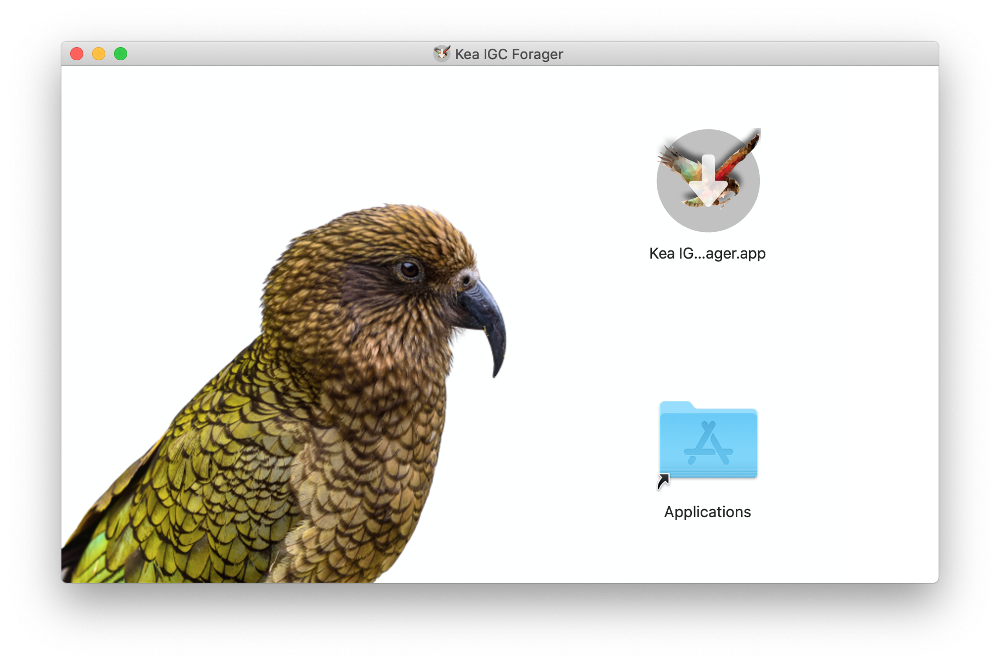

# Kea IGC Forager

A simple and intuitive interface to download .igc files from your flight recorder to Mac.
Open source - if you have an instrument which is currently not supported I invite you to add to this project. \
***Note: that is anything that isn't a Flymaster at the moment, sorry!***

#### Available for
- [x] Mac OSX
- [ ] Linux
- [ ] Windows

#### Screenshots

#### Installing
1. [Find the latest release here](https://github.com/bjoernStriebing/KeaIGC/releases/latest)
1. Download and open **Kea.IGC.Forager.dmg**
1. Then simply drag the app icon into your Applications floder 
1. Done. Ready to launch the app.

## OSX Developer Setup Guide

1. Install `python3.7` via homebrew and make sure it's added to your path
1. `python -m pip install --upgrade pip`
1. `python -m virtualenv --no-site-packages venv3`
1. `. venv3/bin/activate`
1. `pip install -r requirements_osx.txt`

#### Start python app
* Run the default GUI: `./keaigc`
* Run without `*.so` GPS interaces and use modules from source (no IGC signing): `./keaigc --dev`
* Run without GUI: `./keaigc --cmd`
* Show fill list of options: `./keaigc --help`

#### Building the app
Simply run `./packaging/build.sh [--dmg]`. This will do the following:
* setup `PYTHONPATH` for building and clean any old outputs
* compile and sign gps device `*.so` files to enable tracklog authentication
* compile the rest of the app
* if `--dmg` argument is provided: create installer image

*Note: New or modified GPS classes require a private key signature. You can still compile and test your changes without the private key but any IGC files downloaded won't have the G-Record required to validate flights. See command line options above. \
After merging in your pull requests I will build a new release and sign the GPS device library compiled from your code. \
This may seem inconvenient but is necessary to ensure tracklogs can not be manipulated and signed with Kea IGC Forager key*

## Windows Developer Setup Guide

#### vali-xea.exe 32 bit Developer Setup

The following assumes a parallel install of 32 bit python alongside existing 64 bit version
1. Download `python3.7.x` [installer (32bit)](https://www.python.org/ftp/python/3.7.4/python-3.7.4.exe)
1. Install to custom path: e.g. `C:\python3.7_32` while also selecting option to add python to your system path
1. Rename `C:\python3.7-32\python.exe` to discern from 64 bit python: e.g. `C:\python3.7-32\python3_32.exe`
1. Open cmd
1. Upgrade pip: `python3_32 -m pip install --upgrade pip`
1. Install virtualenv: `python3_32 -m pip install virtualenv`
1. Change into this project folder
1. Create virtualenv: `python3_32 -m virtualenv --no-site-packages venv3`
1. Activate virtualenv: `venv3\Scripts\activate`
1. Install dependencies: `pip install -r requirements_vali.txt`

###### Building vali-xea.exe
1. Test the python script: `python3_32 igc\vali.py <IGC_FILE>`
1. `pyinstaller --onefile packaging\vali.spec`
1. Executable should be in `dist\vali-xea.exe`
1. Test the exe: `dist\vali-xea.exe <IGC_FILE>`
